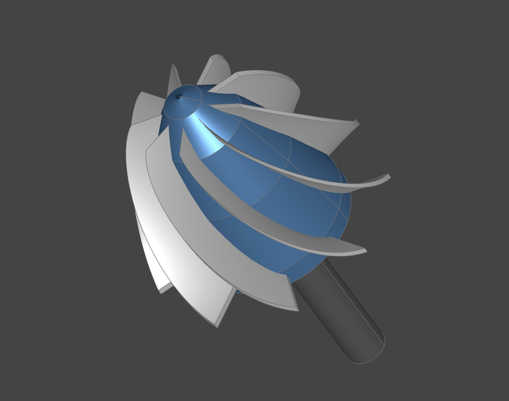
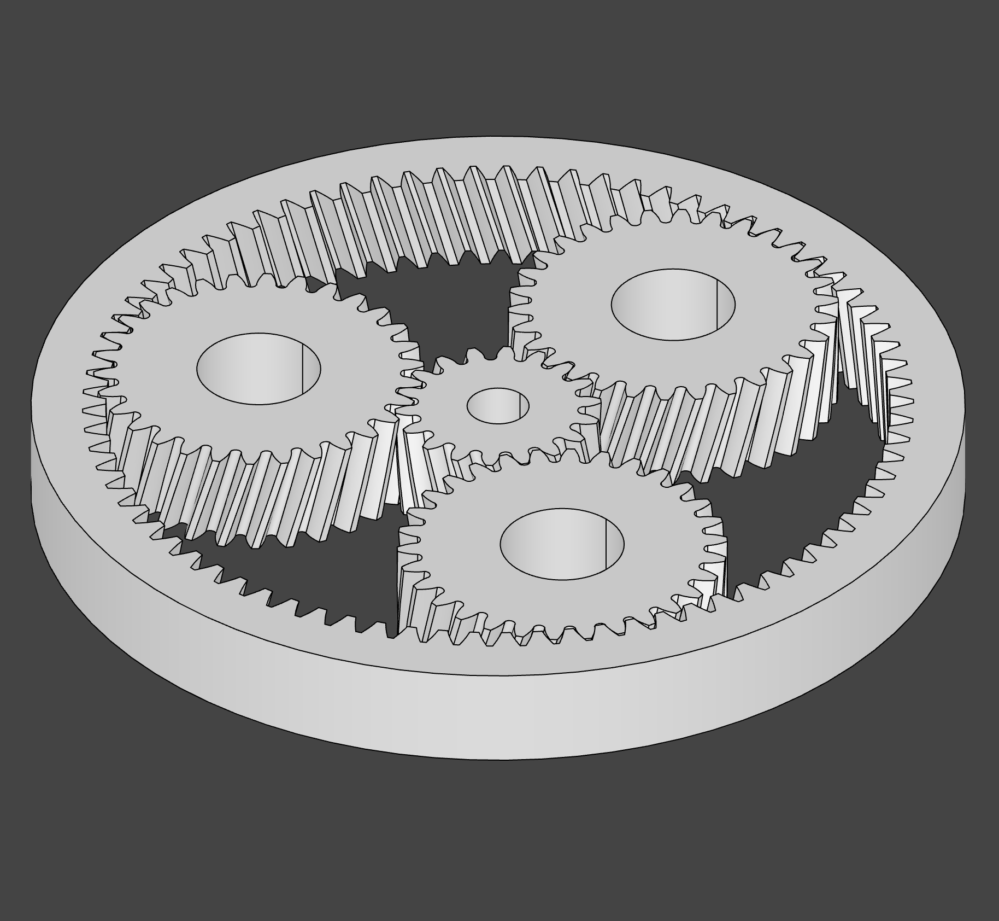
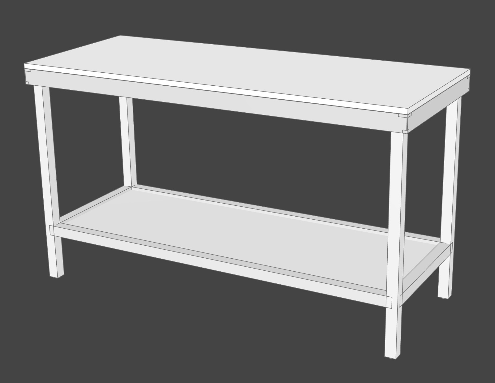
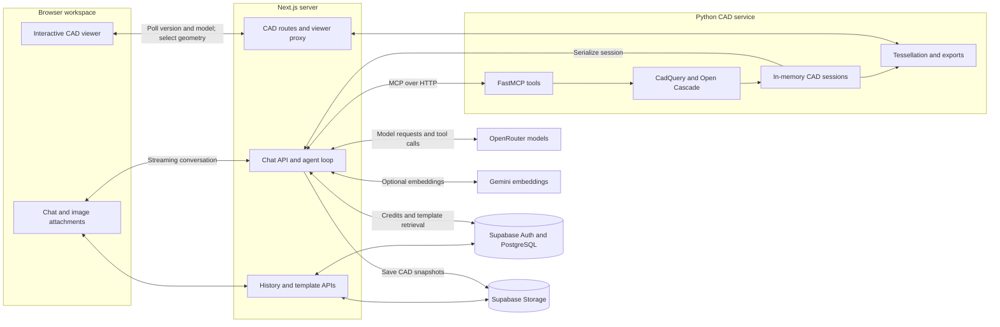
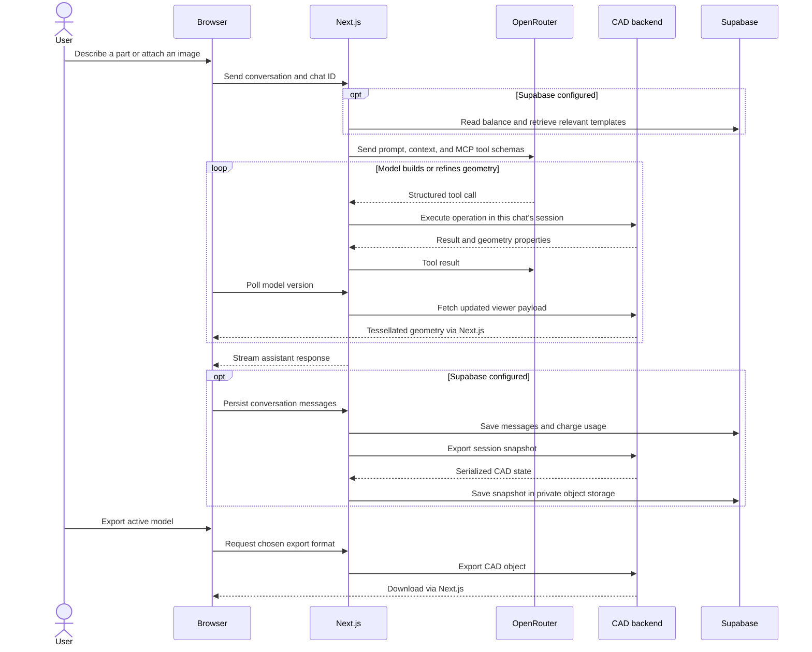
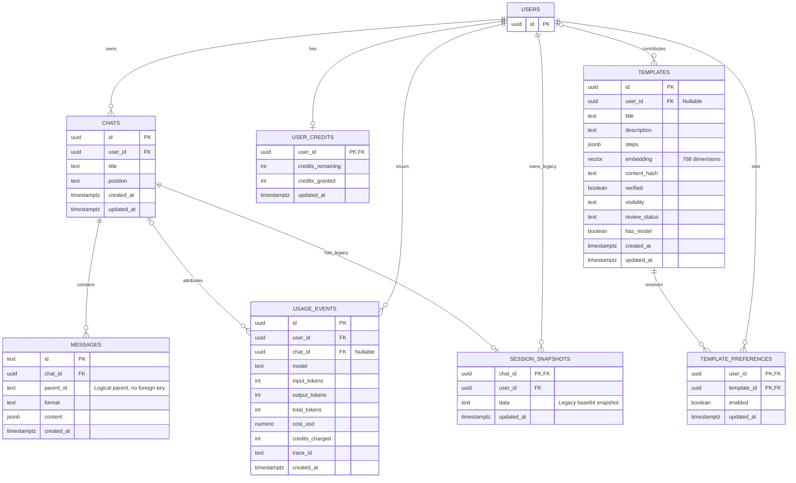

<div align="center">

# Text2CAD AI

**Describe a part. Watch it take shape. Export real CAD.**

Conversational 2D and 3D parametric modeling, powered by structured CAD tools.


[Quick start](#quick-start) · [Features](#features) · [Architecture](#architecture) · [Data model](#data-model) · [Development](#development)

</div>

Text2CAD AI (`t2c`) turns text prompts and reference images into editable CAD geometry. An AI agent calls modeling tools to create sketches, build solids, assemble parts, and refine existing models while a browser viewer updates as it works.

The agent describes **structured modeling operations** instead of generating Python scripts. The backend executes those operations with CadQuery and Open Cascade, keeping real boundary-representation (B-rep) geometry behind the visual preview. The project is aimed at mechanical design, manufacturing workflows, and makers who need exportable parts.

## A look at what you can build

<table>
  <tr>
    <td align="center" width="33%"><br /><strong>Turbine runner</strong></td>
    <td align="center" width="33%"><br /><strong>Planetary gears</strong></td>
    <td align="center" width="33%"><br /><strong>Multi-part assemblies</strong></td>
  </tr>
</table>

Examples from the application's existing gallery. Results depend on the prompt, model, and supported CAD operations.

## Contents

- [Features](#features)
- [Technology](#technology)
- [Quick start](#quick-start)
- [Accounts and persistence](#accounts-and-persistence)
- [Configuration](#configuration)
- [Architecture](#architecture)
- [Data model](#data-model)
- [MCP tools and standalone use](#mcp-tools-and-standalone-use)
- [Repository map](#repository-map)
- [Development](#development)
- [Deployment](#deployment)
- [Troubleshooting and limitations](#troubleshooting-and-limitations)
- [Contributing](#contributing)
- [License](#license)

## Features

| Capability | What it does |
| --- | --- |
| **Text and image to CAD** | Routes prompts through OpenRouter; the latest user prompt determines text or image mode. Routing targets are defined in [models.js](web/lib/models.js). |
| **Live 3D workspace** | Combines streaming chat with an interactive CAD viewer, geometry selection, and measurement tools. |
| **2D and 3D modeling** | Builds sketches, extrusions, revolutions, lofts, sweeps, booleans, fillets, and parametric curves and surfaces through structured operations. |
| **Assemblies** | Combines named parts with placements and constraints; STEP export preserves assembly names, colors, and hierarchy. |
| **Mechanical components** | Provides gears, fasteners, bearings, threads, sprockets, chains, and drafting annotations through CadQuery extensions. |
| **STEP import and direct editing** | Imports existing parts and assemblies, inspects geometry, and supports operations such as resizing holes, removing features, push/pull, shelling, and drafting faces. |
| **Export** | Exports 3D models as STEP, STL, 3MF, AMF, or BREP; 2D sketches also support DXF and SVG. |
| **Resumable workspaces** | With Supabase configured, saves chat history and CAD snapshots so past models can be restored after a backend restart. |
| **Template library** | Captures reusable tool-call recipes, previews saved geometry, and retrieves similar examples with embeddings. Supports private templates, reviewed public templates, and per-user retrieval preferences. |
| **Usage metering** | Tracks per-turn model usage and credits. The included schema grants new users 2,500 credits; 1 credit represents $0.001 of modeled usage. |
| **Optional observability** | Integrates Langfuse tracing and learning reports, PostHog analytics, and Vercel analytics. |

CAD geometry remains B-rep internally; the browser preview and mesh exports are tessellated representations. STEP imports do not recover the original application's parametric feature history.

## Technology

| Layer | Technologies |
| --- | --- |
| Web application | Next.js 15 App Router, React 19, JavaScript with TypeScript UI components |
| Interface and state | Tailwind CSS 4, assistant-ui, shadcn/Radix UI, Zustand |
| AI orchestration | Vercel AI SDK 6, OpenRouter, AI SDK MCP client |
| CAD backend | Python 3.13, MCP Python SDK / FastMCP, Starlette, Uvicorn |
| Geometry and extensions | CadQuery 2.7.0, Open Cascade via OCP, `cq_gears`, `cq_warehouse`, `heatserts` |
| Visualization | `three-cad-viewer`, `ocp-tessellate`, `ocp-vscode` |
| Identity and data | Supabase Auth, PostgreSQL, row-level security, Supabase Storage |
| Template retrieval | pgvector and Gemini `gemini-embedding-001` embeddings at 768 dimensions |
| Observability | Langfuse / OpenTelemetry, PostHog, Vercel Analytics and Speed Insights |
| Testing and tooling | pytest, Ruff, Node's test runner, promptfoo evaluations, GitHub Actions |

Dependency declarations live in [web/package.json](web/package.json) and [mcp_server/pyproject.toml](mcp_server/pyproject.toml). The Python package pins the CAD engine and extension commits; the web app includes an npm lockfile.

## Quick start

The shortest path runs the web app and CAD backend locally **without Supabase**. It skips account checks, persistent chat/model storage, and credit enforcement. You still need an OpenRouter API key with access to the models configured in [web/lib/models.js](web/lib/models.js).

### 1. Prerequisites

- Git and Node.js **22** with npm (the version used by the deployment workflow).
- Python **3.13.7 or newer within 3.13**; the package requires `>=3.13.7,<3.14`.
- A platform supported by the pinned CadQuery/OCP wheels, or Docker using the Linux amd64 image described below.

Commands below use a POSIX shell and start from the repository root unless noted.

```bash
git clone https://github.com/katifrahim/t2c.git
cd t2c

python3.13 -m venv mcp_server/.venv
mcp_server/.venv/bin/python -m pip install --upgrade pip
mcp_server/.venv/bin/python -m pip install -e './mcp_server[dev]'

cd web
npm ci
cp .env.local.example .env.local
```

### 2. Configure the web app

Edit `web/.env.local` and fill in:

```dotenv
BACKEND_URL=http://localhost:8080
OPENROUTER_API_KEY=your-openrouter-api-key
```

Leave `MCP_TOKEN` empty for this loopback-only setup and leave Supabase settings unset. Keep real keys in local environment files, outside version control.

### 3. Start both services

In one terminal, from the repository root:

```bash
MCP_TRANSPORT=http MCP_HOST=127.0.0.1 PORT=8080 \
  mcp_server/.venv/bin/python mcp_server/src/t2c_mcp.py
```

In another terminal, from the repository root:

```bash
cd web
npm run dev
```

Open **[localhost:3000](http://localhost:3000)**. Check backend health with:

```bash
curl http://localhost:8080/health
# {"status":"ok"}
```

> [!NOTE]
> Set `PORT=8080` explicitly: the Python HTTP server defaults to **9000**, while the web app's default backend URL uses **8080**. The backend defaults to **stdio** unless `MCP_TRANSPORT=http` is set.

### 4. Build your first part

Try:

> Create a 60 × 40 × 6 mm rectangular plate with four 5 mm through-holes, each centered 8 mm from its two nearest edges. Round the four outside vertical edges with a 2 mm fillet.

Follow up with a dimensional change, attach a reference image, or select geometry in the viewer to refer to it in chat. Use **Export** to download the active model. Use **Import** to start from a `.step` or `.stp` file.

## Accounts and persistence

Add Supabase to enable authentication, durable histories, CAD snapshots, and usage balances.

### 1. Configure Supabase

Create a Supabase project and add these values to `web/.env.local` (they are additional to the supplied example file):

```dotenv
NEXT_PUBLIC_SUPABASE_URL=https://your-project.supabase.co
NEXT_PUBLIC_SUPABASE_PUBLISHABLE_KEY=your-publishable-key

# Server-only: needed for template preview storage and maintenance scripts.
SUPABASE_SECRET_KEY=your-server-secret-key
```

Use the publishable key for the browser and a server secret/service-role key for `SUPABASE_SECRET_KEY`. Never give a secret key a `NEXT_PUBLIC_` prefix.

### 2. Apply the SQL scripts

For a fresh project, run these files in the Supabase SQL editor **in this order**:

| Order | Script | Purpose |
| --- | --- | --- |
| 1 | [schema.sql](web/supabase/schema.sql) | Chats, messages, indexes, and access policies |
| 2 | [credits.sql](web/supabase/credits.sql) | Credit balances, usage events, signup grants, and charging function |
| 3 | [langfuse.sql](web/supabase/langfuse.sql) | Trace ID column and the charging function signature used by the app |
| 4 | [snapshots.sql](web/supabase/snapshots.sql) | Legacy snapshot table, still queried as a restore fallback |
| 5 | [snapshots-storage.sql](web/supabase/snapshots-storage.sql) | Private `cad-snapshots` bucket and owner-scoped storage policies |
| 6 | [templates.sql](web/supabase/templates.sql) | pgvector, template recipes, and semantic retrieval |
| 7 | [templates-library.sql](web/supabase/templates-library.sql) | Library metadata, preferences, listing, and preview authorization |
| 8 | [templates-storage.sql](web/supabase/templates-storage.sql) | Private `cad-templates` preview bucket |

> [!IMPORTANT]
> Apply `langfuse.sql` after `credits.sql` **even if tracing is disabled**: it installs the `charge_usage` signature the application calls. If you rerun `credits.sql`, rerun `langfuse.sql` afterward to remove the obsolete overload.

### 3. Configure authentication and restart

In Supabase Auth, set the local site URL to `http://localhost:3000` and allow the application's callback and reset destinations:

- `http://localhost:3000/auth/callback` (including the signup `?next=/` variant)
- `http://localhost:3000/reset`

Enable email/password sign-in; configure Google OAuth if you want the Google sign-in option. Optional email templates are in [web/supabase/email-templates/](web/supabase/email-templates/). Add your deployed origin's corresponding URLs when hosting the app.

Restart Next.js after updating the environment. Sign up, build a part, then reopen the chat to check that both messages and geometry restore.

## Configuration

### Web application — `web/.env.local`

| Variable | Purpose |
| --- | --- |
| `BACKEND_URL` | Python backend origin; defaults to `http://localhost:8080`. |
| `OPENROUTER_API_KEY` | Required for model calls. |
| `MCP_TOKEN` | Server-to-server bearer token; must match the backend when configured. |
| `NEXT_PUBLIC_SUPABASE_URL` | Enables Supabase-backed authentication and persistence. |
| `NEXT_PUBLIC_SUPABASE_PUBLISHABLE_KEY` | Browser-safe Supabase project key. |
| `SUPABASE_SECRET_KEY` | Server-only access for template preview blobs and maintenance scripts. |
| `GOOGLE_GENERATIVE_AI_API_KEY` | Enables template embeddings and semantic retrieval; omit to use chat without retrieval. |
| `TEMPLATE_MATCH_THRESHOLD` | Template similarity threshold; defaults to `0.5`. |
| `LANGFUSE_PUBLIC_KEY`, `LANGFUSE_SECRET_KEY`, `LANGFUSE_BASE_URL` | Optional tracing. Set the base URL for your Langfuse region. |
| `NEXT_PUBLIC_POSTHOG_KEY`, `NEXT_PUBLIC_POSTHOG_HOST` | Optional product analytics; the current proxy configuration targets the US region. |
| `NEXT_PUBLIC_ANALYTICS_DEV` | Set to `true` to opt into analytics capture during development. |
| `TURN_SOFT_LIMIT_MS` | Agent turn soft time limit; defaults to `240000` ms, with client continuation support. |

### Python backend — process environment

| Variable | Default | Purpose |
| --- | --- | --- |
| `MCP_TRANSPORT` | `stdio` | Set to `http` for the web application. |
| `MCP_HOST` | `0.0.0.0` | HTTP bind address; use `127.0.0.1` for local-only access. |
| `PORT` / `MCP_PORT` | `9000` | HTTP port; `PORT` takes precedence. |
| `MCP_TOKEN` | Unset | Enables bearer checks on MCP and protected CAD routes. |
| `SESSION_TTL_SECONDS` | `3600` | Idle in-memory session eviction interval. |
| `SNAPSHOT_KEEP_RECENT` | `10` | Number of recent auto-named objects retained by snapshot pruning. |

The backend reads process environment variables; it does not automatically load `web/.env.local`.

## Architecture

### System flow



The browser talks to Next.js. The chat API connects to the Python service over streamable HTTP and passes the chat ID as `X-Session-Id`; viewer routes use `?session=<chatId>`. Each backend session holds named CAD objects, the active model, and a tessellated viewer payload. The viewer polls for changes every second.

### One modeling turn



This diagram summarizes the data flow; message persistence, streaming, and turn settlement are handled by separate callbacks. On chat reopen, the app loads messages from PostgreSQL and restores CAD state from Storage if the backend session needs it.

## Data model

The ERD below shows declared database relationships and selected fields. `auth.users` is managed by Supabase; the other entities are in the `public` schema.



**CAD blobs are stored separately from relational records:**

| Storage bucket | Object path | Contents and access |
| --- | --- | --- |
| `cad-snapshots` | `<userId>/<chatId>` | Serialized CAD session; private, with owner-scoped storage policies. This is the current save path. |
| `cad-templates` | `<templateId>` | Geometry preview snapshot; private, accessed through server routes that check template visibility/ownership. |

These paths are application conventions, not database foreign keys. `session_snapshots` remains a **legacy restore fallback**. Template recipes live in `templates.steps`; preview blobs contain geometry rather than recipes. Raw template reads are mediated by RPCs such as `list_templates`, `match_templates`, and `can_view_template`.

## MCP tools and standalone use

The CAD engine can also run independently of the web app in an MCP client.

| Tool | Responsibility |
| --- | --- |
| `workplane_api` | Chain 3D modeling operations and store or extend named parts. |
| `sketch_api` | Construct and constrain 2D profiles. |
| `assembly_api` | Add, place, constrain, and solve multi-part assemblies. |
| `extension_api` | Discover and build specialized mechanical components. |
| `select_model` | Activate a stored model for viewing and export. |
| `inspect_model` | Inspect geometry at summary, standard, or full detail. |
| `edit_model` | Apply supported direct edits to existing geometry. |
| `query_docs` | Retrieve detailed method and parameter documentation. |
| `report_learning` | Record structured observations for the application's learning-report pipeline. |

For a client that accepts an `mcpServers` configuration, replace `/absolute/path/to/t2c` below with your checkout:

```json
{
  "mcpServers": {
    "t2c": {
      "command": "/absolute/path/to/t2c/mcp_server/.venv/bin/python",
      "args": ["/absolute/path/to/t2c/mcp_server/src/t2c_mcp.py"],
      "env": { "MCP_TRANSPORT": "stdio" }
    }
  }
}
```

For visual feedback in stdio mode, start the separate viewer from the repository root:

```bash
mcp_server/.venv/bin/python -m ocp_vscode
```

The standalone viewer uses port **3939**. HTTP clients instead connect to `/mcp` on the configured backend port; include `Authorization: Bearer <MCP_TOKEN>` when enabled and `X-Session-Id` to distinguish sessions.

## Repository map

```text
t2c/
├── web/                       Next.js app, API routes, chat, and CAD viewer
│   ├── app/                   Pages, auth callbacks, and server APIs
│   ├── components/            Workspace, viewer, chat, and template library
│   ├── lib/                   Model routing, state, persistence, and telemetry
│   ├── public/                CAD gallery and vendored viewer assets
│   └── supabase/              SQL setup scripts and maintenance utilities
├── mcp_server/
│   ├── src/                   MCP tools, STEP import, and direct-edit engine
│   ├── tests/                 Geometry and tool regression tests
│   ├── eval/                  Model evaluations and grading rubrics
│   ├── docs/                  Imported-model editing notes
│   ├── Dockerfile             Containerized HTTP backend
│   └── pyproject.toml         Python dependencies and tooling
├── onshape/                   Onshape-to-tool-recipe reconstruction tooling
├── selfimprove/               Drawing-driven server improvement workflow
└── .github/workflows/         CI, automation, and web deployment
```

## Development

### Local checks

After installing the development dependencies, run from the repository root:

```bash
mcp_server/.venv/bin/python -m pytest mcp_server/tests onshape/tests
mcp_server/.venv/bin/python -m ruff check mcp_server/src/t2c_mcp.py
node --test web/lib/learnings.test.mjs

cd web
npm run build
```

The Next.js configuration currently skips TypeScript and ESLint errors during builds, and Ruff's configured rule selection is empty. A successful build/lint invocation is therefore not a complete static-analysis check. The backend GitHub workflow is opt-in through the `run-ci` PR label and currently runs Ruff, with its pytest step commented out; run the relevant tests locally.

### Evaluation and supporting workflows

| Workflow | Entry point | Notes |
| --- | --- | --- |
| **Model evaluations** | [Evaluation guide](mcp_server/eval/GUIDE.md) | promptfoo runs CAD tasks through MCP, with deterministic checks and LLM or human grading. Requires API access; model calls incur usage. |
| **Onshape reconstruction** | [Onshape README](onshape/README.md) · [Handoff](onshape/HANDOFF.md) | Reconstructs supported native Part Studio features into tool-call recipes, checking candidate geometry against Onshape at each feature. Uses the backend venv and `ONSHAPE_ACCESS_KEY` / `ONSHAPE_SECRET_KEY`. |
| **Server self-improvement** | [Workflow README](selfimprove/README.md) · [Runner](selfimprove/run.sh) | Uses drawing images and a modeler → judge → editor ↔ verifier loop to improve server code. Requires a locally patched Claude CLI; it edits and commits code, so use a dedicated worktree. |
| **Template maintenance** | [Re-embedding](web/supabase/reembed-templates.mjs) · [Chat ordering backfill](web/supabase/backfill-positions.mjs) | Administrative scripts with their own usage instructions and server credential requirements. |

The self-improvement runner and worktree setup script contain workstation-specific defaults. Supply your own drawing folder and main-checkout path; run the setup helper only in a separate worktree because it recreates that worktree's virtual environment. Consult the runner for current tunables.

## Deployment

The deployment layout separates the Next.js web service from the Python CAD process. Supabase supplies identity, relational storage, and private object storage.

### Containerized CAD backend

Build from the repository root:

```bash
docker build --platform linux/amd64 -f mcp_server/Dockerfile -t t2c-mcp .
docker run --rm --platform linux/amd64 \
  -p 127.0.0.1:8080:8080 -e PORT=8080 t2c-mcp
```

This is a local smoke-run configuration. The image supplies the native libraries required by the CAD engine and sets HTTP transport. Its pinned Linux OCP wheels target amd64; Apple Silicon Docker builds use emulation. For hosted use, configure `PORT` and a shared `MCP_TOKEN` through the hosting environment.

### Web service

Deploy `web/` as the Next.js project root, set `BACKEND_URL` to the CAD service, and configure the environment variables and Supabase redirect URLs above. The included [Vercel workflow](.github/workflows/deploy-web.yml) deploys relevant `main` changes and expects `VERCEL_TOKEN`, `VERCEL_ORG_ID`, and `VERCEL_PROJECT_ID` in GitHub Actions secrets.

Live CAD state is **process-local**. Keep requests for a session on the same backend process; adding replicas requires session-aware routing or an explicit shared-state design. Durable snapshots support restoring saved work but do not synchronize live replicas.

`MCP_TOKEN` protects `/mcp` and individually guarded CAD routes; it is not blanket authentication for every backend route. Viewer/model routes use session IDs. Configure backend network exposure accordingly, and keep serialized session snapshots inside trusted storage and server-to-server flows.

## Troubleshooting and limitations

| Symptom | Check |
| --- | --- |
| Web app cannot connect to CAD | Confirm HTTP transport and matching ports. The quick start explicitly uses `8080` for both services. |
| Backend returns `401` | Match `MCP_TOKEN` on the web and Python services. Restart after environment changes. |
| Chat fails before building | Check the OpenRouter key, available balance, and access to the routing targets in `web/lib/models.js`. |
| Chats or geometry disappear after reload | Enable Supabase, apply the SQL scripts, and check private snapshot storage. Minimal local mode has no durable persistence. |
| Credit RPC errors | Apply `langfuse.sql` after `credits.sql`, regardless of whether Langfuse tracing is enabled. |
| Template hints or previews are missing | Check the Gemini key, template migrations, `SUPABASE_SECRET_KEY`, and `cad-templates` bucket. Public retrieval also requires approval. |
| CAD dependencies fail to install | Check the exact Python range and native wheel availability; use the amd64 Docker image when appropriate. |
| DXF or SVG export is rejected | These formats are available only for 2D sketches. Use STEP or a supported 3D format for solids and assemblies. |

Imported-model editing has a limited operation set. Geometry selections can become unstable after topology-changing edits, and some complex face modifications are rejected by the kernel. Large assemblies can be expensive to import and tessellate. See the [imported-model editing notes](mcp_server/docs/imported-model-editing.md) for implementation context and known gaps; some historical commands there refer to earlier branches and local fixtures.

## Contributing

Use [GitHub issues](https://github.com/katifrahim/t2c/issues) for reproducible bugs and focused feature proposals. For CAD issues, include the prompt or minimal tool-call sequence, expected geometry, actual behavior, and a shareable input file when relevant.

For changes, keep pull requests focused, add regression coverage for geometry or tool behavior, run the relevant local checks, and describe any setup or schema impact. Use Conventional Commit subjects such as `fix: ...`, `feat: ...`, or `docs: ...`. Keep API keys, private models, and local run artifacts out of commits.

## License

This repository currently does not include a `LICENSE` file. No project-wide license is declared here; dependencies and vendored assets retain their own license terms.
